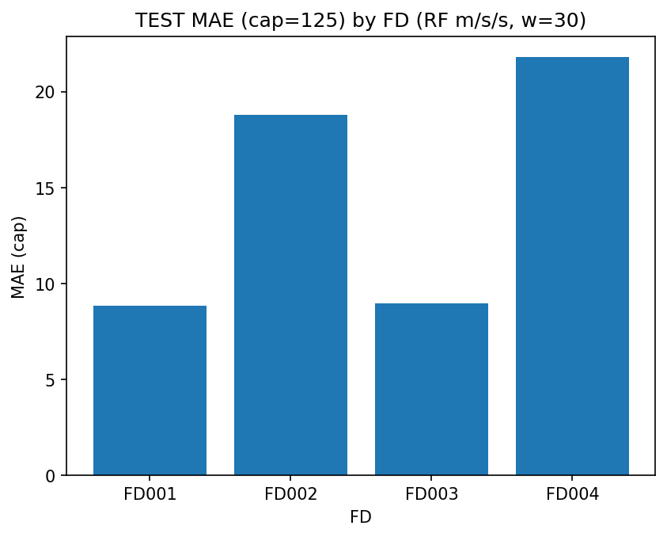

# Predictive Maintenance — CMAPSS RUL (NASA)

Remaining Useful Life (RUL) prediction for turbofan engines using the NASA CMAPSS dataset.

**Model:** RandomForestRegressor  
**Features:** rolling **mean / std / slope** over last **30** cycles  
**Target:** RUL capped at **125**

## Project structure

```text
Predictive Maintenance/
  data/                # raw data (kept out of git)
  models/              # trained models + metadata
  notebooks/           # experiments / EDA
  reports/             # metrics, preds, and generated figures
    figures/
  src/                 # inference code (CLI)
```

## Results (cap)

| fd | val_mae_cap | val_rmse_cap | test_mae_cap | test_rmse_cap | nasa_cap |
|---|---|---|---|---|---|
| FD001 | 9.379 | 12.737 | 8.845 | 11.718 | 209.032 |
| FD002 | 20.020 | 24.184 | 18.781 | 22.671 | 3549.323 |
| FD003 | 7.811 | 11.272 | 8.972 | 12.643 | 359.936 |
| FD004 | 19.938 | 25.027 | 21.800 | 27.119 | 14595.733 |

## Test MAE by FD



## How to run

### 1) Create venv & install

```bash
python -m venv .venv
source .venv/bin/activate
pip install -r requirements.txt
```

### 2) Put CMAPSS data

Place files under:

```text
data/raw/cmapss/CMAPSSData/
  train_FD001.txt ... train_FD004.txt
  test_FD001.txt  ... test_FD004.txt
  RUL_FD001.txt   ... RUL_FD004.txt
```

### 3) Predict (example)

```bash
python -m src.predict --data data/raw/cmapss/CMAPSSData/test_FD001.txt --unit-id 1
```

> Note: current CLI uses FD001 model by default (we can extend it to auto-pick FD002/3/4 next).
